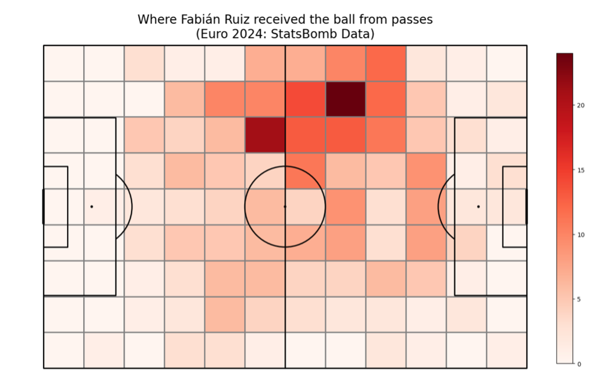
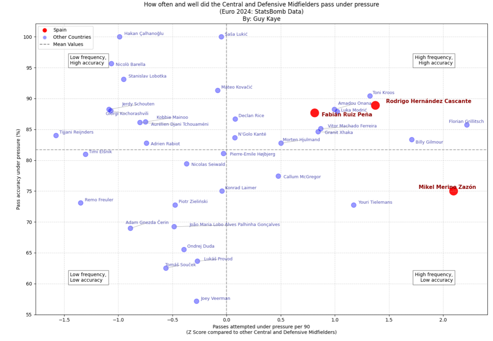

# Euro 2024 Player Analysis: Fabián Ruíz
**By: Guy Kaye**

## Introduction

Heading into Euro 2024, Spain were still searching for redemption after a disappointing Round of 16 exit at the 2022 World Cup and a heartbreaking semifinal loss to Italy at Euro 2020.

Their last major tournament triumph dated back 12 years, when a golden generation led by Xavi, Iniesta, Busquets, Fàbregas, and Xabi Alonso dominated world football. With Gavi sidelined due to injury, a high-pressure but high-reward opportunity emerged for Fabián Ruiz.

Rising to the occasion, Fabián became a key figure in Spain's Euro 2024 success under Luis de la Fuente, starting six of their seven matches in the tournament. Operating as the left-sided central midfielder—the 'left eight'—in Spain's 4-3-3 system, he played a crucial role in dictating play and linking the midfield to attack. Not only was Fabián a progressive passer and ball carrier who frequently initiated threatening sequences, but he also proved decisive in the final third—scoring two goals and providing one assist.

## Hypothesis

This analysis explores how Fabián's technical security under pressure and intelligent movement contributed to Spain's Euro 2024 triumph. In particular, I examine two key aspects of his performance that underpinned Spain's midfield dominance:

**First**, I hypothesize that Fabián consistently received the ball in advanced and strategically threatening positions—particularly in the left half-space—enabling Spain to progress their attacks effectively.

**Second**, I propose that Fabián was among the most effective midfielders in the tournament at retaining possession under pressure, a trait essential to Spain's control-oriented style of play.

## Spatial Analysis

The heat map shows where Fabián Ruiz received the ball from teammates during Euro 2024. While there's a clear concentration in the left half-space—typical for his role as a left central midfielder—he also appeared in deeper areas and occasionally drifted across to the right. 

Notably, there's a high number of receptions in advanced zones, suggesting he often positioned himself between the lines and was ready to threaten the opponent's last defensive line. This spatial awareness and flexibility allowed Spain to progress through the left while also using Fabián to recycle play, switch sides, or accelerate attacks depending on the situation.

## Press Resistance Analysis

To assess Fabián Ruíz's ability to support teammates under pressure, I compared central and defensive midfielders that attempted more than 25 passes under pressure in the tournament based on two metrics:

- **Frequency** of passes attempted under pressure per match (standardized using a z-score)
- **Success rate** of those passes (passing accuracy under pressure)

The plot above is divided into four quadrants using mean values for both axes. Fabián stands out in the top-right: **high frequency, high accuracy** quadrant. He attempted pressured passes at a rate **0.82 standard deviations above the average**, while also maintaining an impressive **86.7% accuracy**, far exceeding the 81.7% mean. This places him among the most press-resistant midfielders in the tournament.

These numbers are even more telling in context: Spain's possession-based approach under Luis de la Fuente relied heavily on midfielders who could operate cleanly in tight spaces. Fabián's calmness and precision under pressure weren't just standout traits—they were fundamental to Spain's control-oriented style.

## Conclusion

Fabián Ruiz emerged as a key figure in Spain's Euro 2024 triumph—not just for his goals and assists, but for his composure, intelligence, and technical quality under pressure. His positioning, ability to receive in dangerous zones, and press-resistant passing were central to Spain's midfield dominance. In a tournament defined by fine margins, Fabián's contributions proved vital in turning Spain's possession into consistent control and ultimately, success.

Further analysis could explore his defensive work and off-ball movement as well as compare Fabian's tournament output to his club performances to better understand how Spain optimized his role.

---

