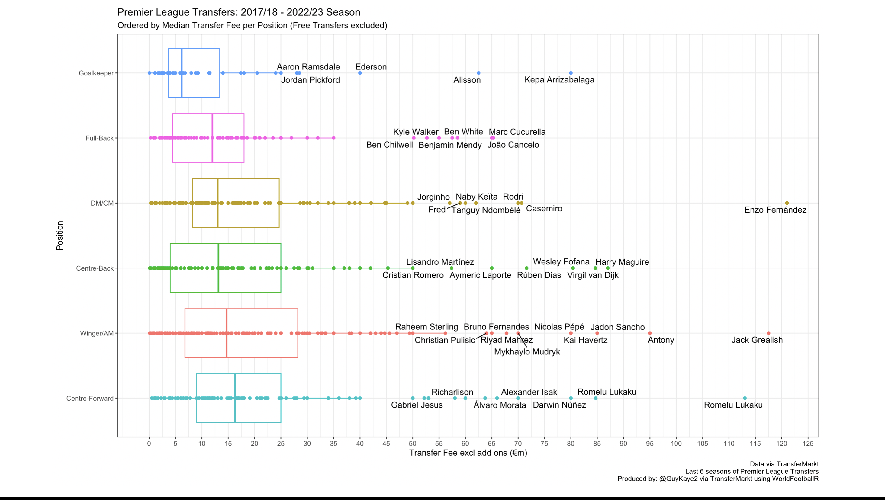

# Most Valued Positions in Football: A Transfer Market Analysis

*Analysis of positional transfer spending across Europe's Top 5 leagues (2017/18 - 2022/23)*

## Executive Summary

This analysis examines which football positions command the highest transfer fees by analyzing six seasons of transfer data from Europe's top five leagues. The study reveals that **attacking positions (particularly Center Forwards) generally command premium prices**, though significant variations exist between leagues.

A key component of this analysis explores **positional side preferences** - whether clubs pay more for left-sided players (left-backs, left-wingers) compared to their right-sided counterparts (right-backs, right-wingers). This "side premium" can reveal market inefficiencies, tactical preferences, or supply/demand imbalances in the modern game.

**Crucially, the analysis reveals how different leagues' tactical cultures and playing styles directly influence their transfer market valuations**. From the Bundesliga's willingness to invest heavily in high-quality defensive players (despite being known for fast-paced, attacking football) to Serie A's three-center-back systems driving defender demand, each league's unique football philosophy is reflected in their spending patterns and positional priorities.

**Key Findings:**
- Center Forwards are the most expensive position overall
- Premier League median fees significantly exceed other leagues, representing ~39% of total Big 5 expenditure
- Attacking players generally valued higher than defensive players (with notable Bundesliga exception)
- Left-back premium is consistent across Europe (4/5 leagues), while left-wing premium varies by league
- Bundesliga uniquely values defenders (CB, DM) over attackers
- Goalkeepers are generally the least expensive position

## Introduction

Determining the "most valued" position in football is complex, as every club has different needs based on their squad profile. However, financially strong teams in Europe's elite leagues often require specific players with particular characteristics, creating high demand but low supply scenarios that drive up prices.

This analysis uses transfer expenditure as a proxy for positional value, examining spending patterns across Europe's top five leagues.

## Methodology

**Data Source:** TransferMarkt via WorldFootball R package by @jaseziv  
**Time Period:** Six seasons (2017/18 - 2022/23)  
**Scope:** Transfers into Europe's top five leagues (Premier League, La Liga, Serie A, Bundesliga, Ligue 1)  
**Exclusions:** Free transfers and loans  
**Key Metric:** Median transfer fee (to avoid skewing by outlier transfers)

### Positional Categories
- **Goalkeepers (GK)**
- **Full-backs (FB):** Left Back (LB), Right Back (RB)
- **Center-backs (CB)**
- **Midfielders (MF):** Central Midfielders (CM), Defensive Midfielders (DM)
- **Wingers/Attacking Midfielders (Winger/AM):** Left Wing (LW), Right Wing (RW), Attacking Midfielder (AM)
- **Center Forwards (CF)**

## The Premier League Premium: A Market Distortion

Before examining individual league patterns, it's crucial to understand the Premier League's outsized influence on the transfer market. The English top flight's median transfer fees far exceed those of other European leagues, creating what many consider a "Super League" effect in terms of spending power.

**Premier League Market Dominance:**
- Represents approximately **39% of total Big 5 league expenditure**
- If spending were distributed evenly across five leagues, each would represent 20%
- This massive disparity indicates the Premier League's exceptional financial superiority
- This disparity significantly skews combined European transfer analysis

*Figure 1: Premier League vs Other Leagues - Spending Comparison*

This financial dominance means Premier League clubs can afford to pay premium prices for players, inflating the overall market and making their positional valuations less representative of broader European trends. When analyzing the combined data, this Premier League effect must be considered as it artificially elevates certain positional values.

## Key Findings by League
**Most Valuable Position:** Center Forward  
**Positional Hierarchy:** CF > Winger/AM > CB > MF > FB > GK

*Figure 1: Premier League positional value boxplots*

### Premier League
**Most Valuable Position:** Center Forward  
**Positional Hierarchy:** CF > Winger/AM > CB > MF > FB > GK

*[Visualization 1: Premier League positional value boxplots]*

**Transfer Volume & Expenditure Patterns:**
The Center Forward (CF) and Center Back (CB) positions saw the highest transfer activity, representing the most transferred-in positions. However, expenditure was distributed relatively evenly across position groups until a notable drop-off at Full-backs and Goalkeepers.

**Notable Insights:**
- **Significant outliers in Goalkeeper category:** Despite being the cheapest position overall, some goalkeepers commanded substantial transfer fees
- **Left-side premium confirmed:** Left Wingers cost more than Right Wingers; Left Backs more expensive than Right Backs  
- **Defensive Midfielder premium:** DMs valued higher than Central Midfielders, suggesting tactical importance of defensive stability
- **Attacking bias:** Clear preference for attacking players over defensive ones in transfer spending

### La Liga  
**Most Valuable Position:** Wingers/Attacking Midfielders  
**Positional Hierarchy:** Winger/AM > CF > CB > MF > FB > GK

*[Visualization 2: La Liga positional value analysis]*

### La Liga  
**Most Valuable Position:** Wingers/Attacking Midfielders  
**Positional Hierarchy:** Winger/AM > CF > CB > MF > FB > GK

*[Visualization 2: La Liga positional value analysis]*

**Transfer Volume & Expenditure Patterns:**
Similar to the Premier League, Center Forwards and Center Backs were the most transferred-in positions. However, there was a greater proportional spend on the Winger/AM group, with less even distribution compared to England, particularly showing reduced investment in defensive players.

**Notable Insights:**
- **Tactical shift:** Unlike Premier League, Wingers/AMs command highest median fees
- **Attacking preference maintained:** Similar trend with attacking players costing more than defensive ones
- **Left Wing premium persists:** Left Wingers again more expensive than Right Wingers
- **Full-back parity:** Left Backs no longer command premium over Right Backs (contrasts with PL trend)
- **Goalkeeper baseline:** GK remains least expensive position

### Serie A
**Most Valuable Position:** Center Forward  
**Positional Hierarchy:** CF > Winger/AM > CB > MF > FB > GK

*[Visualization 3: Serie A positional breakdown]*

### Serie A
**Most Valuable Position:** Center Forward  
**Positional Hierarchy:** CF > Winger/AM > CB > MF > FB > GK

*[Visualization 3: Serie A positional breakdown]*

**Transfer Volume & Expenditure Patterns:**
A key difference in Serie A: the Winger/AM category was no longer the most transferred-in group. Instead, Midfielders and Center-Backs dominated transfer activity, likely reflecting the prevalence of three-center-back systems in Italian football. Like the Premier League, expenditure was spread relatively evenly across positions.

**Notable Insights:**
- **Tactical influence on transfers:** Higher CB and MF activity suggests 3-CB formations driving demand
- **Reverse wing premium:** Right Wingers more valuable than Left Wingers (unusual trend)
- **Consistent full-back pattern:** Left Backs still cost more than Right Backs
- **Goalkeeper value floor elevated:** GKs represent 52% of CF price (higher proportion than other leagues)
- **Strategic defensive investment:** Even spending distribution indicates balanced squad-building approach

### Bundesliga
**Most Valuable Position:** Center-backs & Defensive Midfielders  
**Positional Hierarchy:** CB/DM > CF > Winger/AM > FB > GK

*[Visualization 4: Bundesliga unique valuation pattern]*

**Transfer Volume & Expenditure Patterns:**
The Center Forward and Center Back positions remained the most transferred-in, with Winger/AM as the most transferred category (consistent with other European leagues). Despite this unique valuation pattern, expenditure remained evenly distributed across positions.

**Notable Insights:**
- **Revolutionary approach:** Only league where defensive players (CB, DM) command highest fees
- **Tactical philosophy reflected:** German emphasis on defensive solidity and midfield control
- **Unexpected hierarchy:** Full-backs cost more than Wingers/AM based on median values
- **Consistent transfer patterns:** Despite different valuations, transfer volume patterns mirror other leagues
- **Balanced investment:** Even expenditure distribution suggests strategic, calculated approach

### Ligue 1
**Most Valuable Position:** Center Forwards & Midfielders  
**Positional Hierarchy:** CF/MF > Winger/AM > CB > FB > GK

*[Visualization 5: Ligue 1 analysis with outlier effects]*

### Ligue 1
**Most Valuable Position:** Center Forwards & Midfielders  
**Positional Hierarchy:** CF/MF > Winger/AM > CB > FB > GK

*[Visualization 5: Ligue 1 analysis with outlier effects]*

**Transfer Volume & Expenditure Patterns:**
Consistent with other leagues, Center Forwards and Center Backs were the most transferred-in positions, with Winger/AM as the most transferred category. However, the massive outlier transfers of Neymar and Mbappé dramatically skewed expenditure percentages, inflating both Winger/AM and CF categories well beyond normal market values.

**Notable Insights:**
- **Market disruption:** Neymar (€222m) and Mbappé (€180m) transfers created unprecedented outliers
- **Goalkeeper anomaly:** GK no longer cheapest position (unique among Big 5 leagues)
- **Left-side consistency:** Left Wingers and Left Backs more expensive than right-sided equivalents
- **Skewed spending analysis:** Outlier transfers make expenditure percentages less representative of true market
- **PSG effect:** Single club's extreme spending altered entire league's transfer landscape

## Combined Analysis: Europe's Top 5 Leagues

*[Visualization 6: Combined league positional values]*

**Critical Context:** The combined analysis must be interpreted with caution due to the Premier League's disproportionate influence. With approximately 39% of total Big 5 league expenditure (compared to an expected 20% if evenly distributed), Premier League spending significantly skews the overall European picture.

**Overall Positional Hierarchy:**
1. **Center Forward** - Most expensive position
2. **Wingers/Attacking Midfielders** 
3. **Midfielders**
4. **Center-backs**
5. **Full-backs** 
6. **Goalkeepers** - Least expensive

### Universal Patterns Across Europe

**The Attacking Premium:** While attacking players generally command higher fees than defensive players across most leagues, this is not universal. **The Bundesliga notably bucks this trend by valuing Center-backs and Defensive Midfielders above Center Forwards and Wingers**. This is particularly interesting given the Bundesliga's reputation for fast-paced, attacking football with frequent transitions - suggesting German clubs recognize that quality defensive players are essential foundations for their high-tempo style.

**The Left-Side Premium - A Nuanced Pattern:** The preference for left-sided players shows interesting variations across positions and leagues:

**Left Wing vs Right Wing:**
- **LW Premium:** Premier League, La Liga, Ligue 1 (3/5 leagues)
- **RW Premium:** Serie A, Bundesliga (2/5 leagues)
- **Market insight:** More evenly split, suggesting tactical or supply/demand variations by league

**Left Back vs Right Back:**  
- **LB Premium:** Premier League, Serie A, Bundesliga, Ligue 1 (4/5 leagues)
- **No Premium:** La Liga only
- **Market insight:** Strong consistent trend across Europe, suggesting genuine scarcity of quality left-backs

**Key Takeaway:** The left-back premium appears to be a genuine European-wide market phenomenon (80% of leagues), while the left-wing premium is more league-specific, potentially reflecting different tactical preferences or player availability across competitions.

**League-Specific Philosophy:** Each league's transfer patterns reflect distinct tactical philosophies:
- **Premier League:** Pure attacking focus with financial muscle
- **La Liga:** Technical attacking play (Winger/AM premium)  
- **Serie A:** Tactical flexibility (3-CB system influence)
- **Bundesliga:** Defensive foundation (CB/DM priority)
- **Ligue 1:** Superstar effect (extreme outliers)

## Limitations & Considerations

1. **"Squad-building Effect":** Some positions naturally require more players (e.g., teams need both LW/RW options, multiple CBs for different formations), affecting both transfer volume and total expenditure. This creates inherent bias toward positions with higher squad requirements.

2. **Premier League Market Distortion:** The English league's massive spending power (39% of Big 5 expenditure vs expected 20%) significantly skews combined analysis. Their ability to pay premium prices inflates overall European transfer values and makes their positional valuations less representative of broader market trends.

3. **Extreme Outlier Impact:** Single transfers like Neymar (€222m) and Mbappé (€180m) can dramatically alter league-wide statistics, particularly in smaller markets like Ligue 1.

4. **Exclusion Bias:** Not including free transfers and loans may miss significant player movements, particularly for high-value players in final contract years or loan-to-buy arrangements.

5. **Positional Flexibility:** Modern football's tactical evolution means players increasingly operate across multiple positions, making rigid positional categorization potentially misleading.

6. **Temporal Market Factors:** Transfer values are influenced by market conditions, contract situations, selling club's financial position, and broader economic factors beyond pure positional value.

7. **Sample Size Variations:** Some positions (especially goalkeepers) have smaller sample sizes, making median calculations potentially less reliable.

## Conclusions

While not a perfect measure, median transfer fees provide valuable insights into positional valuation across European football. The analysis confirms that **attacking players, particularly Center Forwards, command premium prices** in the transfer market, reflecting their direct impact on scoring goals and winning matches.

However, league-specific preferences exist, with some competitions (notably the Bundesliga) placing higher value on defensive solidity. The consistent premium for left-sided players suggests either scarcity of quality options or tactical preferences in modern football.

This data provides useful context for clubs planning transfer strategies and understanding market dynamics across different positions and leagues.

---

*Data collected from TransferMarkt via WorldFootball R package. Analysis covers transfers into Europe's top 5 leagues from 2017/18 to 2022/23 seasons.*
