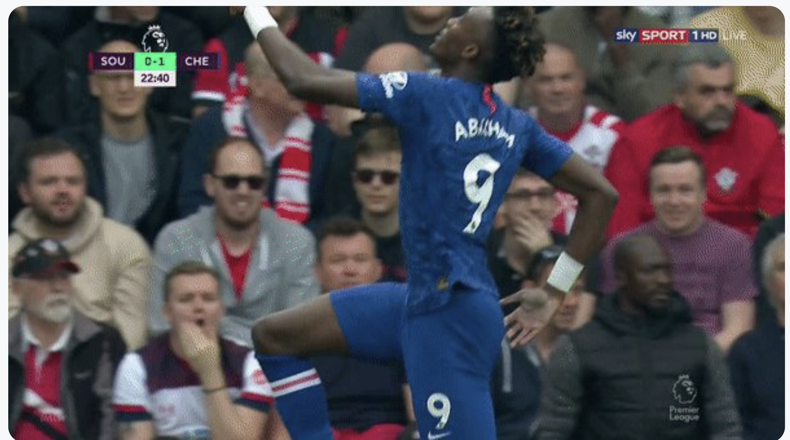
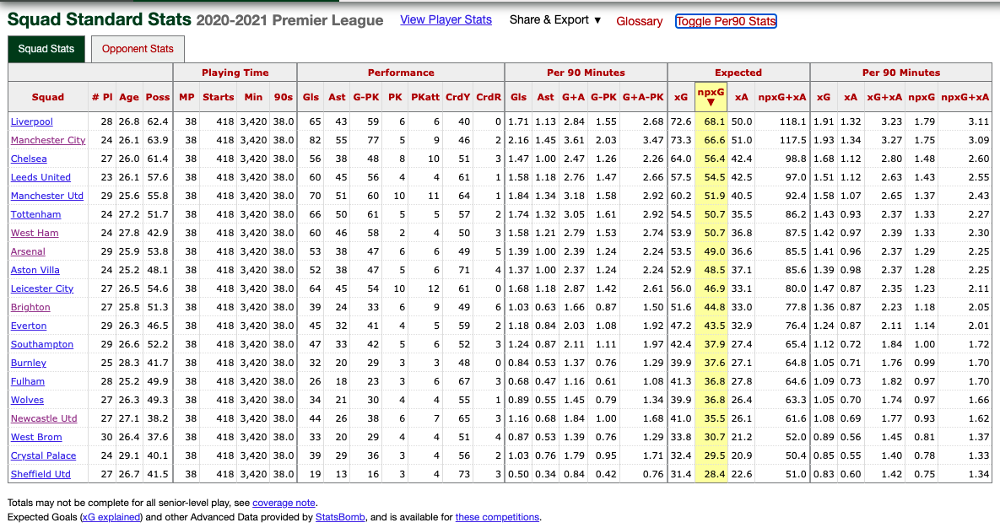
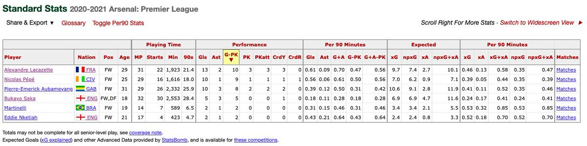
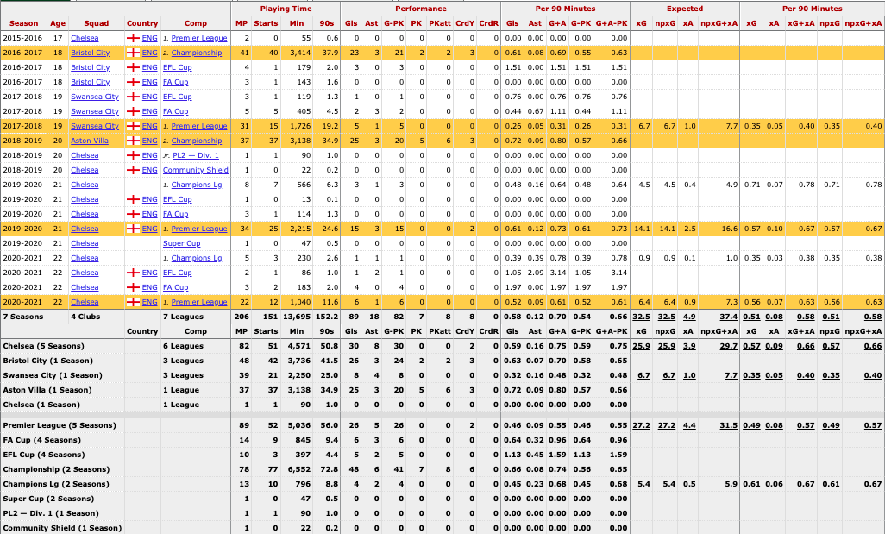
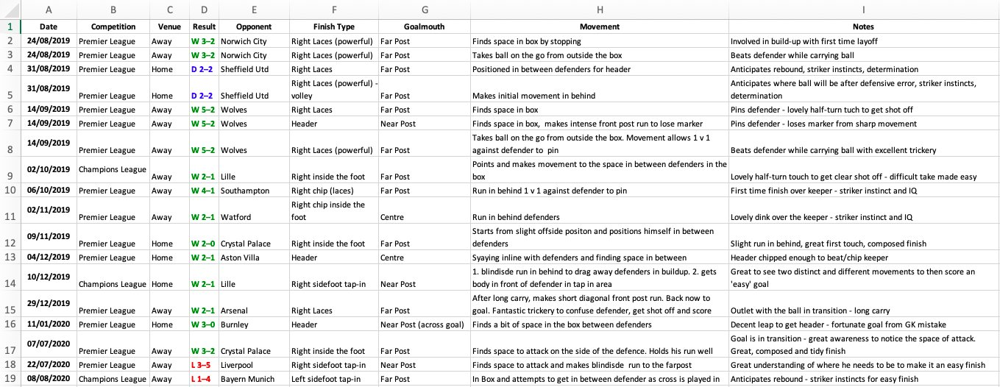
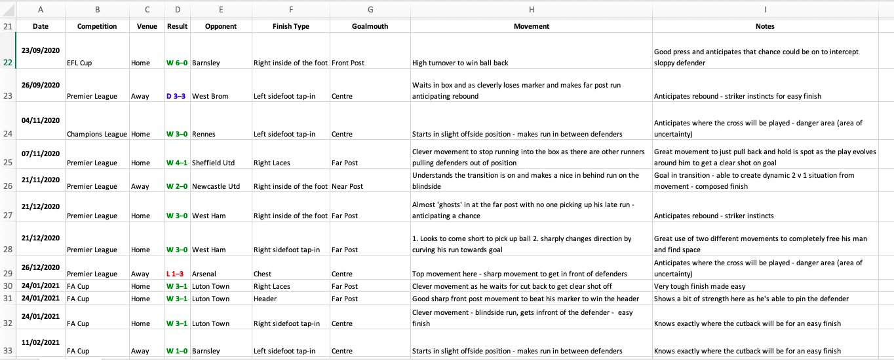
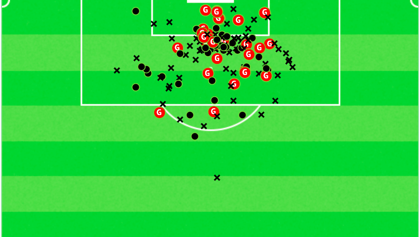

# Tammy Abraham — Scouting Report

Tammy Abraham has left Chelsea yesterday for a fee of around €40m to join Mourinho’s AS Roma.

The English 23 year old and #9 attracted heavy interest from clubs such as Atalanta and Arsenal.

I decided to do a scout report on him with the use of video in conjunction with data.  

As an Arsenal fan, it became clear from last season that a goal-scoring striker was needed.  
Although Arsenal's NPxG p90 dramatically improved in the League since Smith-Rowe's inclusion against Chelsea in December (1.01 to 1.45), they lacked a goal-threat from their strikers.

While he offered some link-up play ability and scored more than expected, Lacazette's NPxG p90 of 0.35 wasn't desirable for a team looking to get back into the top 4.  
Aubameyang's output in front of goal fell (A LOT) and was worryingly poor on the ball.

Abraham was identified.

---

## Goal Scoring Profile

Tammy Abraham as a goal-scorer, for an 18–19 year old in the Championship, looked an incredibly exciting talent.  
At Swansea, his xG output was solid considering the team, league and age.  
At Villa, like Bristol, he scored lots.  
Then at Chelsea, his top goal ratio remained.

### Goals — 2019/20 Season

Let's look at all 18 goals Tammy scored for Chelsea in the 19/20 season.

It's fantastic to see a variety of finishes as he's able to score with his head and display great ball striking ability.  
He's a presence in the box, can bully defenders and is a threat in transition.

▶️ [View goals (2019/20)](videos/Tammy_Abraham_19_20_Goals.mp4)

### Goals — 2020/21 Season

Here are his 12 goals for Chelsea from last season.

His ability to create tap-in opportunities for himself by positioning himself in between defenders and making blindside runs is exceptional.  
He has fantastic 'poacher instincts' as he's ready to capitalise on keeper rebounds.

▶️ [View goals (2020/21)](videos/Tammy_Abraham_Goals_20_21.mp4)

---

## Movement & Shot Selection

It's hard to pick a specific goal to analyse, so I analysed each one in these tables.  
There's lots of variety in the types of goals scored and finishes used.

I really like his use of movement — whether it's blindside runs, winning the back of the defender, or ghosting far post.

One of my favourite attributes of Abraham is his shot selection.  
Here is a shot-map from InStat of all of his shots for Chelsea.

Dots: on target  
X: blocked/wide shots

Tammy's NPxG per shot at Chelsea (UCL + PL) is **0.176** — very good.  
Very few wasted shots outside the box.

---

## Finishing Weaknesses

A common critique of Tammy is his supposed poor finishing ability.  
But, when looking at StatsBomb data (FBRef) in his appearances for Chelsea (PL + UCL), Tammy scored only **0.9 goals less than expected**.

However, he underperforms his xG in heading with mis-timed jumps and scant power.

▶️ [View heading chances](videos/Tammy_Abraham_Heading.mp4)

Another weakness of Abraham is his left foot finishing where he underperforms his xG.

This isn't to say that Abraham cannot finish with his head or left foot — but there is room for improvement and he's just better with his right.  
Every top player will miss big/easy chances.

▶️ [View left-foot chances](videos/Tammy_Abraham_Left_Foot.mp4)

---

## Off-Ball Movement

Ignore the finishing for this clip.  
I really want the focus to only be on the exceptional movement displayed.

Like we saw in the goal-scoring clips — lots of variety.

Over time, these runs will pay dividends and he will be able to score more goals.

▶️ [View movement compilation](videos/Tammy_Abraham_Movement.mp4)

---

## Creativity & Link-Up Play

So far we've dove deep and analysed Abraham's goal and ball-striking ability, his quality shot selection, his movement and the different facets of his finishing through video and data.

Now it's time to analyse creativity.

Let's take a look at all of Tammy's assists for Chelsea.

▶️ [View assists](videos/Tammy_Abraham_Assists.mp4)

Good to see again — a variety — of different assists.  
Abraham is most effective at providing from first-time layoffs either in the box, or by coming deeper.  
He can also run the channels and play dangerous low box crosses.

However, his creative metrics are left to be desired.

The perception, due to his 'lanky' frame, is that Tammy is poor on the ball and cannot link up play well.  
However, I think this is harsh and that he has shown the ability to do so.  
When he has support from beneath and runners around him, he flourishes.

▶️ [View link-up play](videos/Tammy_Abraham_Link_Up.mp4)

Abraham can be very effective in link-up as mentioned with supporting runners with flicks/layoffs — especially when he plays one-touch.  
However, he doesn't always get it right.  
When balls are played at his feet at pace — he struggles more.  
At times, he takes too many touches.

---

## Defensive Contribution

Let's now focus on him without the ball.

Looking at his work-rate and pressing off the ball, Tammy shows determination in abundance as he hunts with intense pressing.  
He helps his team out defensively, but also offensively, as he looks to win turnovers high up the pitch to score.

Tammy intelligently will often curve his runs to block opponents passing lanes while cover-shadowing, which really helps his team be effective in the press.  
Hence, in 'rest defence', Abraham usually contributes well.

Finally, Abraham doesn’t shirk defensive responsibility when the opposition has a corner as he’s ready in the box to head clear the ball away from danger.  
Moreover, he can also be an outlet on transition in these situations.

---

## Summary

### Pros
- Can score a variety of goals  
- Ball striking ability / technique  
- Variety of movement (blindside runs, runs in behind)  
- Physical presence and can boss defenders  
- Outlet in transition  
- First time layoffs / flicks for link-up  
- Intense pressing, showing fight and determination  
- Covers passing lanes well  
- Defends corners  

### Cons
- Left foot finishing (slight weakness)  
- Attacking and finishing headers  
- Link-up play and first touch when ball is drilled into him  
- Slightly inconsistent  

Overall, I think **£35m is a very good deal** for Tammy Abraham.  
There is a potential huge upside as he will probably score lots.  
At just 23 years old — he’s got ample time to develop and improve.

Some are put off by his frame or clumsiness but overlook his effect — a true **“Moneyball” signing**.

That’s it — thanks a lot for reading and watching the scout report.  
This took lots of time and effort and it was my first scout report ever.
